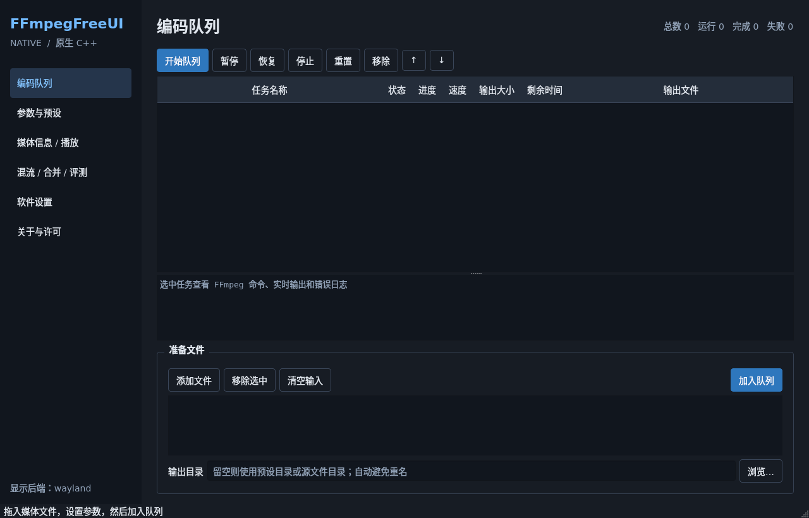
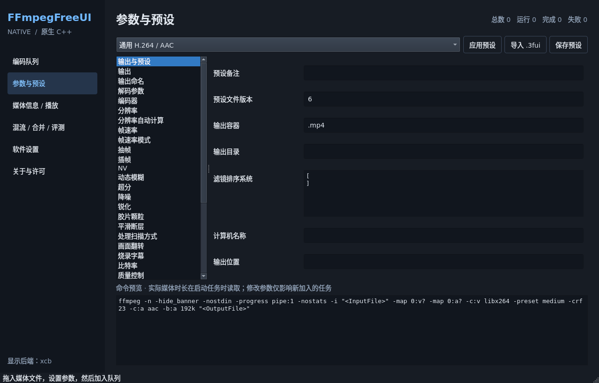

# 0.1.0 验证记录

验收日期：2026-10-07。此记录对应 `native-cpp-linux` 分支的首个 C++ 原生版本；原版全部功能的迁移范围和限制见 [README.md](README.md)。

## 编译与核心功能

| 环境 | 工具链 | 实际结果 |
| --- | --- | --- |
| Debian 12 amd64 | GCC 12.2、C++23、Qt 6.4.2、Ninja | Release 构建通过，CTest 中的 44 项核心检查通过 |
| Windows x64 | Qt 6.8.3、匹配的 MinGW 13.1、C++23、Ninja | Release 构建通过，相同 44 项核心检查通过 |
| Fedora 43 x86_64 | 安装本次 RPM，Qt 6.10.3、FFmpeg 7.1.5 | 安装、动态链接、CLI 和双显示后端通过 |

核心检查实际调用 FFmpeg，覆盖：中文/空格/引号路径、v6 预设与未知字段往返、186 个字段与 11 个内置预设、音频编码器别名、参数分词和占位符、软件转码及分辨率/AAC 校验、真实二次编码、暂停/恢复/停止、队列恢复、已有文件保护、精剪双定位、随机与补零命名、修改时间保留。不包含硬件编码性能测试。

Debian 安装 deb 后，由 `/usr/bin/ffmpegfreeui` 执行 `--transcode` 和 `--probe`，成功得到 H.264/AAC 两条流。Fedora 安装 RPM 后以发行版 FFmpeg 执行 FFV1/PCM 转码，ffprobe 确认输出编码正确。Fedora 的 `ffmpeg-free` 编码器集合与 Debian 的 FFmpeg 不同。

## 实际界面渲染

Debian 和 Fedora 均启动真实 Weston headless compositor 与 Xvfb。Wayland 测试同时提供 `WAYLAND_DISPLAY` 和 `DISPLAY`，程序报告 **wayland**，证明优先原生 Wayland；强制 X11 后报告 **xcb**。截图尺寸 1280×820，窗口可见、186 个字段已创建、图片保存成功。Fedora 使用普通 `nobody` 用户运行 GUI，不需要 root。

Windows 便携目录在 PATH 只包含 Windows 系统目录时成功启动和截图，报告 **windows**，证明无需本机 Qt SDK 的 PATH。已查看实际截图，修正了标题裁切、占位文字对比度和表单标签宽度。

可复现的双后端测试脚本为 [tests/display-smoke.sh](tests/display-smoke.sh)。截图和关键原始日志在 [docs/validation](docs/validation)。

## 安装包

- DEB：CPack 自动解析共享库依赖，并明确依赖 FFmpeg、Qt Widgets、Wayland 和 QPA 插件；`dpkg -i` 实际安装通过，`ldd` 无缺失库。
- RPM：在 Debian 构建，已于 Fedora 43 实际安装验证；自动共享库依赖、Qt Wayland、FFmpeg/ffprobe 依赖及 `AGPL-3.0-only AND MIT` 元数据已检查。其他 RPM 发行版尚未实测，建议在目标发行版重新构建。
- Windows：动态 Qt 部署、编译器运行库、Qt/MinGW 许可和对应源码获取说明随便携包提供。FFmpeg 三个外部程序不随包分发。
- 源码压缩包包含应用源码、资源、预设、CMake、CI、许可和测试；SHA-256 清单位于交付目录。

## 尚未验证或未移植

没有在真实 GNOME/KDE 用户会话验证缩放、输入法、portal、剪贴板及 GPU 编码/滤镜；双后端渲染采用软件合成。Windows 创建/访问时间保留、所有编码器和全部滤镜组合未逐项实测。Linux 修改文件创建时间会明确拒绝；修改/访问时间使用 Qt 文件 API。

原版 .NET 插件、Agent、LibreHardwareMonitor、更新器、NV_FRUC/VapourSynth 管线及部分复杂流处理尚未移植，详见 README；本版不宣称与上游全部功能等价。GitHub CI 配置已提供，本地验证不等于 GitHub Actions 已执行成功。编译使用隔离的临时 Debian 环境；未将源码部署到现有 VPS 服务。
